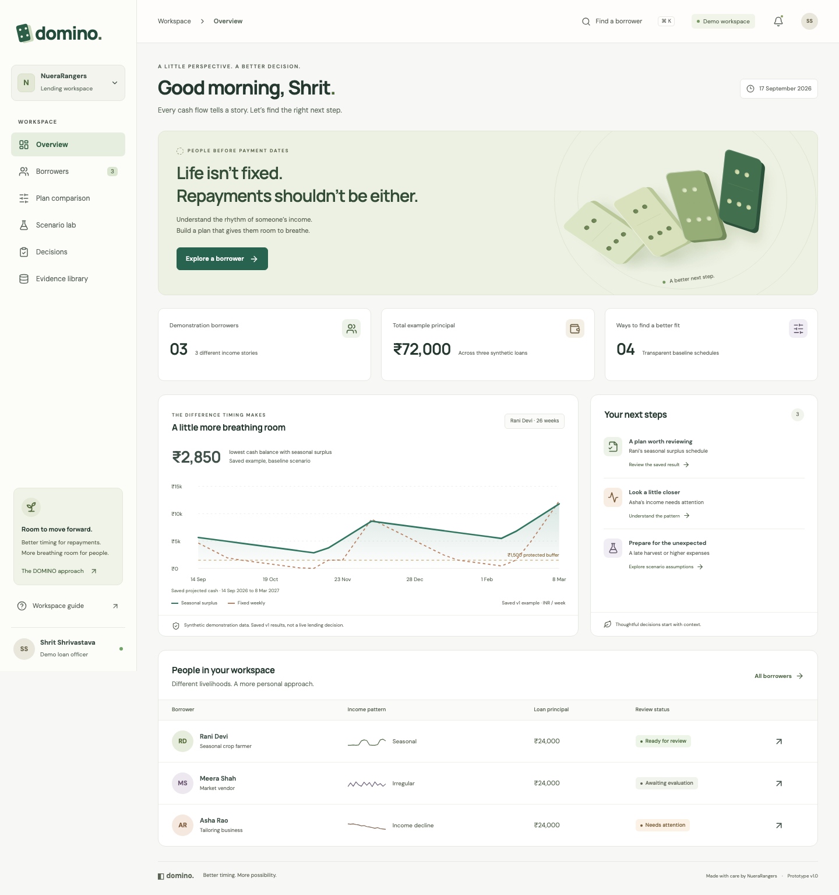
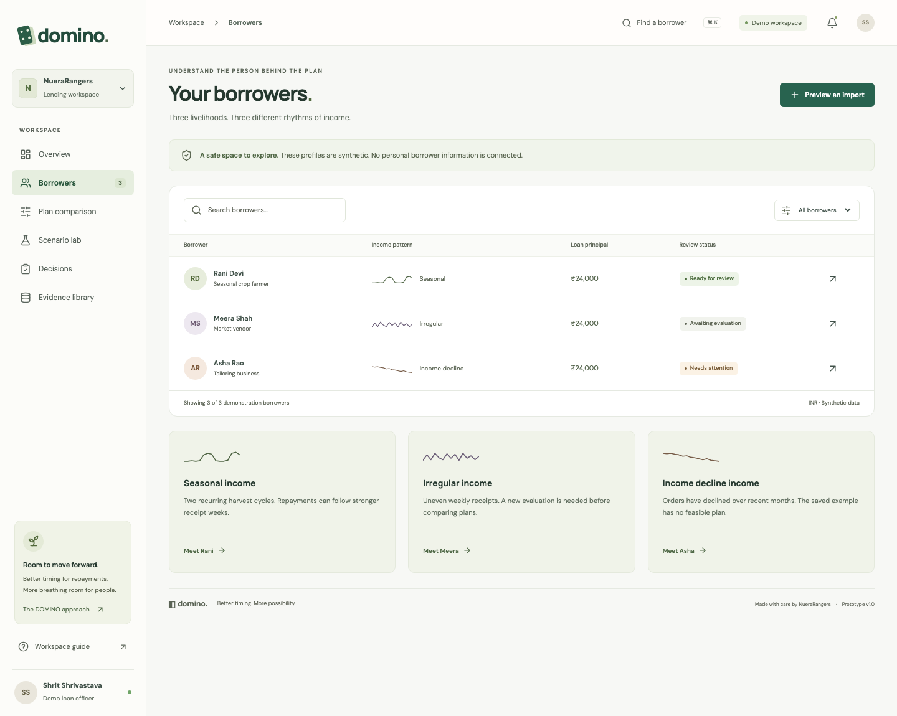
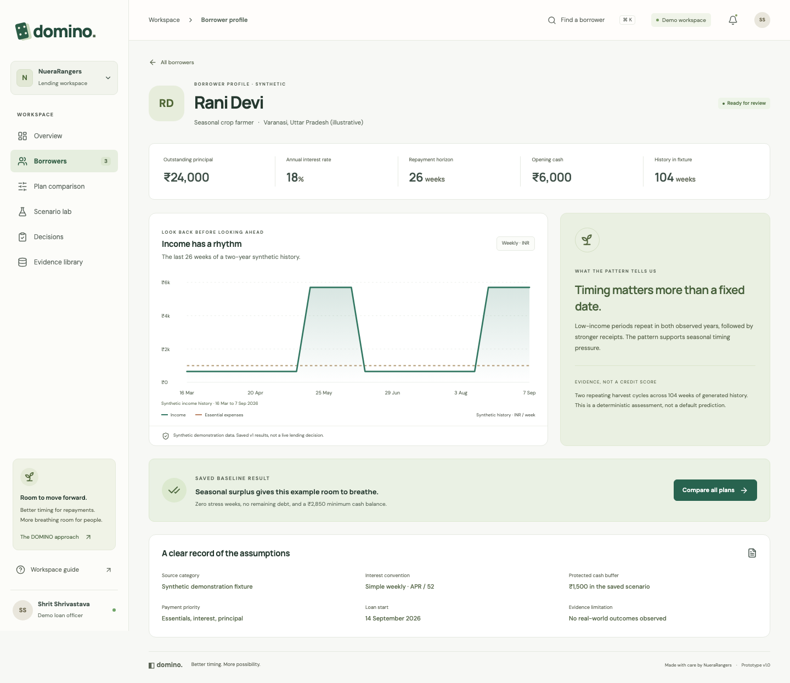
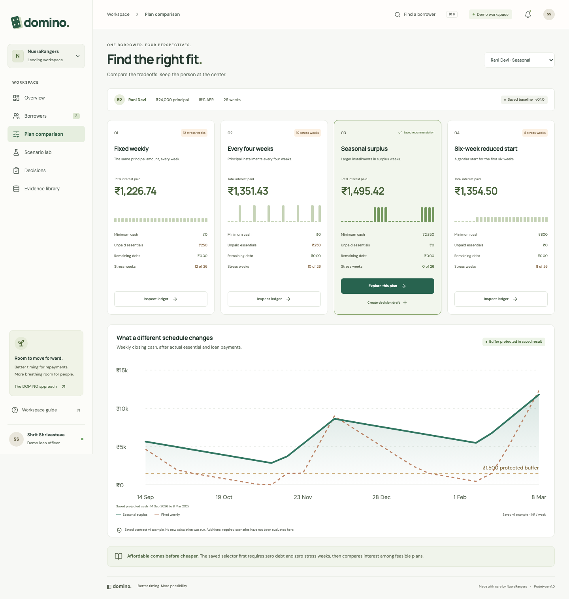
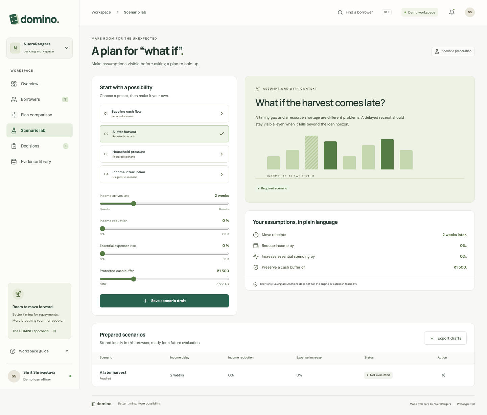
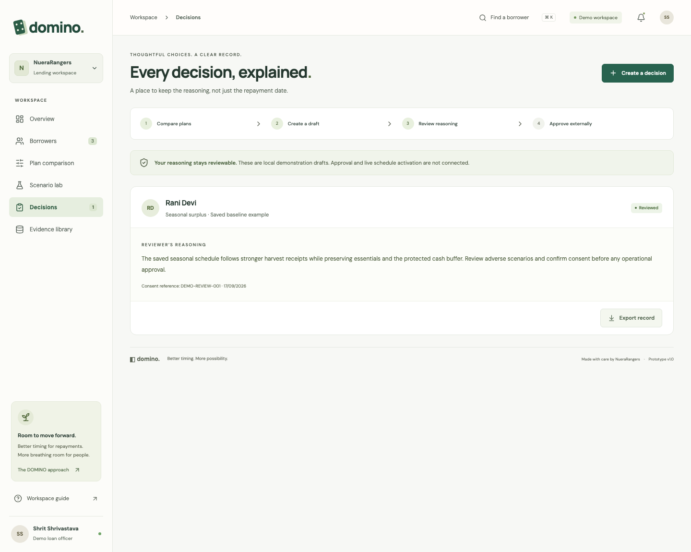
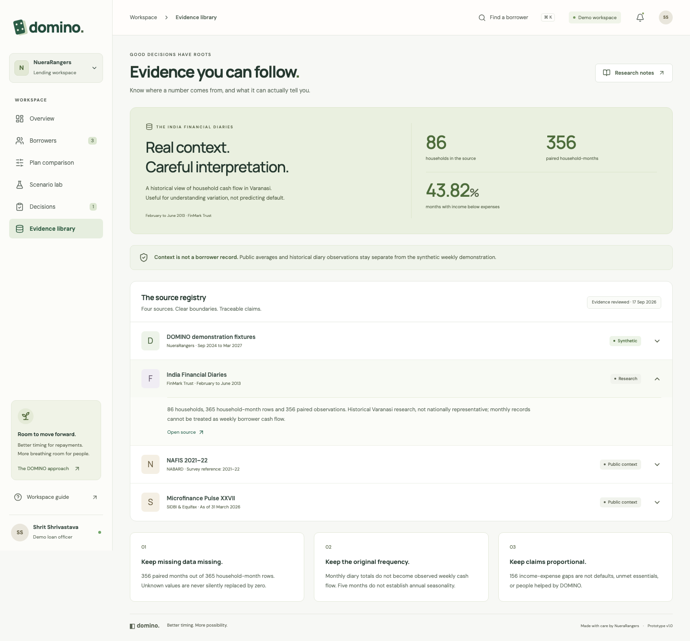
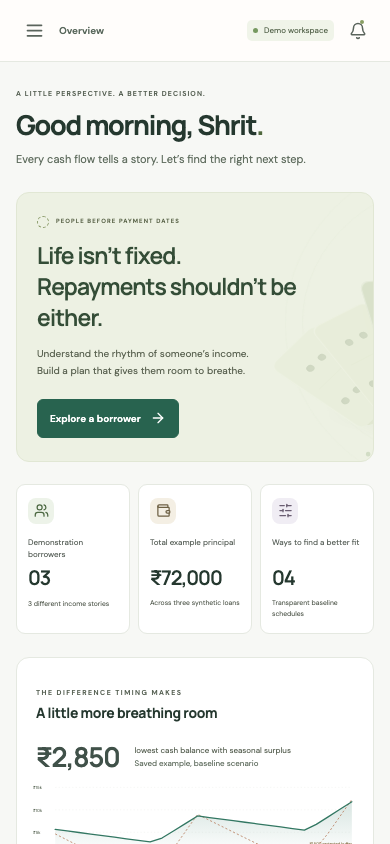
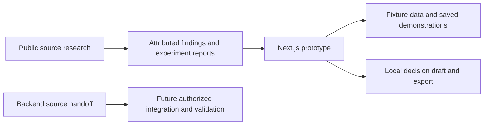

<div align="center">

# DOMINO

### Repayment plans that move with real life.

A thoughtful workspace for reviewing cash flow, comparing repayment plans, and making the evidence behind a decision visible.

[](https://github.com/Shrit1401/tt_mitblr/actions/workflows/frontend.yml)


**Next.js · React · TypeScript · INR-first · Responsive prototype**

[Explore the interface](#the-interface) · [Run locally](#run-locally) · [Experiments](#experiments-and-verification) · [Architecture](docs/architecture.md) · [Implementation guide](output/DOMINO-Implementation-Guide.md)

</div>



<p align="center"><sub>Actual DOMINO prototype. Borrower records, portfolio metrics, and repayment illustrations are synthetic demonstration data.</sub></p>

## Why DOMINO

A fixed repayment date can collide with a household's income cycle. DOMINO makes that timing visible so a reviewer can examine essential expenses, cash buffers, payment dates, interest, and evidence together.

The experience follows a practical journey: find a case, understand its cash flow, compare schedules, explore adverse conditions, inspect the sources, and prepare a reviewable decision. A clean visual hierarchy keeps the proposed plan and its tradeoffs easy to read.

This repository delivers a working frontend prototype, a separately organized backend implementation, and reproducible public-data research. **The backend is deliberately unexecuted and untested, as requested.** The browser uses fixtures and local decision drafts. No real loan is approved or changed by this prototype.

## The interface

### A clear starting point

The overview combines portfolio context, a cash-flow view, upcoming work, and case navigation. Source labels and demonstration markers keep the meaning of the numbers visible.

### Every case has a different rhythm

Search by name, livelihood, or location. Filter by income pattern, open a profile, and inspect the assumptions behind its saved result. Rani has a saved seasonal example, Asha has a saved no-feasible-plan example, and Meera's profile clearly shows that an evaluation is still needed.

<table>
  <tr>
    <td width="50%"><a href="docs/images/borrowers.png"></a></td>
    <td width="50%"><a href="docs/images/borrower.png"></a></td>
  </tr>
  <tr>
    <td><strong>Find the next case.</strong><br />Searchable profiles, income patterns, and clear review states.</td>
    <td><strong>Understand the person.</strong><br />History, loan assumptions, and the evidence behind the pattern.</td>
  </tr>
</table>

### Compare the tradeoffs. Prepare for change.

Compare four saved schedules, open their complete 26-week ledgers, and export the rows as CSV. The scenario lab lets you prepare receipt delays, lower income, higher expenses, and a protected buffer as local drafts. It records assumptions without running a new financial evaluation.

<table>
  <tr>
    <td width="50%"><a href="docs/images/comparison.png"></a></td>
    <td width="50%"><a href="docs/images/scenarios.png"></a></td>
  </tr>
  <tr>
    <td><strong>Make the tradeoffs visible.</strong><br />Four schedule families with timing, cost, liquidity, and stress metrics.</td>
    <td><strong>Prepare the what-ifs.</strong><br />Adjust, save, remove, and export explicitly unevaluated scenario drafts.</td>
  </tr>
</table>

### Leave a decision someone can follow

Record the reasoning behind a saved feasible plan, add an optional demonstration consent reference, mark the draft reviewed, and export a JSON record. The evidence library keeps fixture data, historical research, and published context distinct, with expandable source details and direct references.

<table>
  <tr>
    <td width="50%"><a href="docs/images/decisions.png"></a></td>
    <td width="50%"><a href="docs/images/evidence.png"></a></td>
  </tr>
  <tr>
    <td><strong>Keep the reasoning.</strong><br />Local draft, review state, and a portable decision record.</td>
    <td><strong>Keep the source in view.</strong><br />Source periods, data-quality context, and clear limits on each claim.</td>
  </tr>
</table>

### Designed for smaller screens, too

The workspace adapts its navigation, cards, charts, and comparisons for mobile review.

<p align="center">
  <a href="docs/images/mobile.png"></a>
</p>

### What you can do

| Workspace | Prototype interaction |
| --- | --- |
| Overview | Review the demonstration portfolio and open a case |
| Borrowers | Search, filter, and inspect three synthetic profiles; preview a small CSV locally |
| Compare plans | Switch between two saved borrower evaluations, inspect four plans and 26-week ledgers, and export CSV |
| Scenario lab | Adjust presets; save, remove, and export unevaluated assumption drafts |
| Evidence | Expand source records and inspect periods, research findings, provenance, and limitations |
| Decisions | Write reasoning, save a local draft, mark it reviewed, and export its JSON record |

Screenshots are captured from the implemented application. The prototype's displayed repayment results are demonstration artifacts, not a fresh execution of the delivered backend.

Try a complete walkthrough: open **Rani Devi**, choose **Compare all plans**, inspect **Seasonal surplus**, and create a decision draft with a review reason. In **Decisions**, mark it reviewed and export the record. Then open **Asha Rao** to inspect the no-feasible-plan state, prepare assumptions in **Scenario lab**, and follow the original sources in **Evidence library**.

The import preview accepts `date,income_inr,essentials_inr` CSV files up to 64 KB. It displays the first eight rows locally and never uploads the file or imports operational records. Decision and scenario drafts are stored in the current browser; they are not shared lender records.

## Run locally

Requirements: **Node.js 22.12+** and npm.

```sh
git clone https://github.com/Shrit1401/tt_mitblr.git
cd tt_mitblr
npm ci
npm run dev
```

Open [localhost:3000](http://localhost:3000). The browser prototype needs no API keys, database, Redis server, or worker.

For a standalone static prototype:

```sh
npm run build:prototype
npm run preview
```

The isolated build copies only the frontend into `.prototype-build/` and exports its static pages. It does not build API handlers, the calculation engine, database code, workers, or the optimizer.

## Experiments and verification

The verification scope follows the request: exercise the frontend and run the public-data experiments while leaving the backend untouched by tests or runtime execution.

```sh
npm run check:frontend
npx playwright install chromium firefox webkit
npm run build:prototype
npm run test:frontend
npm run test:research
```

| Track | Evidence |
| --- | --- |
| Frontend | **144 checks passed: 48 each in Chromium, Firefox, and WebKit.** Strict TypeScript and the isolated static build also passed. See [implementation status](docs/implementation-status.md) for the verification scope. |
| Public research, full local run | **9 experiments passed, 0 skipped**, using the original locally retained research sources |
| Public research, distributable checkout | **1 aggregate-consistency experiment passed; 8 source-dependent experiments explicitly skipped** when running in published-only mode |
| Backend, API, engine, database, worker, optimizer | **Not run, built, tested, or benchmarked** in this delivery |

The [research experiment report](docs/research-experiments.md) explains each experiment, exact commands, inputs, exclusions, and results. Machine-readable records are in [experiment-results.json](data/public/experiment-results.json) and [published-check-results.json](data/public/published-check-results.json).

This research analyzes public evidence. It does not measure DOMINO's effects on repayment or borrower wellbeing. A recorded full local run remains historical evidence when its original inputs are intentionally absent from the public checkout.

## Evidence that stays honest

| Source | What the repository uses | What it does not establish |
| --- | --- | --- |
| Synthetic DOMINO cases | Repeatable interface examples and saved demonstration responses | Real borrowers, actual loan decisions, or observed outcomes |
| NABARD NAFIS 2021-22 | Published household income and consumption context | An individual borrower's repayment capacity |
| SIDBI / Equifax, Microfinance Pulse XXVII | Dated sector context, as of 31 March 2026 | DOMINO users, customers, or people helped |
| India Financial Diaries via FinMark | Historical monthly household research, Varanasi and outskirts, February to June 2013 | Weekly borrower histories, confirmed loan defaults, or national estimates |

The diary analysis contains **86 households**, **365 household-month rows**, and **356 paired income/expense observations**. Income is below reported expense outflow in **156 of 356 paired months (43.82%)**. Missing observations remain missing, and negative reported income values remain flagged. This is an observed monthly income-expense comparison, not a count of unpaid essentials or loan defaults.

The self-hosted fonts and icon notices are recorded in [third-party notices](docs/third-party-notices.md). See [repository consolidation](docs/cleanup.md) for the cleanup scope.

Read [source provenance](data/public/provenance.md), [the analysis](data/public/finmark_cashflow_analysis.md), and [the model card](docs/model-card.md) for periods, denominators, transformations, and limitations. Publisher PDFs, raw responses, and household-level files with unresolved redistribution terms are excluded from the public repository. Attributed aggregate results and reproducible analysis source remain available.

## Architecture



The application separates presentation, contracts, calculations, data adapters, and persistence. The backend handoff includes a TypeScript calculation foundation, strict schemas, route and service code, a PostgreSQL/outbox design, worker infrastructure, and an optional integer-optimization path. Its implementation and limitations are documented in [the backend guide](docs/backend.md).

The production design requires immutable snapshots, versioned policies, scenario replay, durable jobs, and an authorized approval process. These are documented with acceptance gates; their presence in source does not mean those gates have passed.

```text
apps/
  web/                 Next.js interface and separately scoped API source
  worker/              Calculation and outbox worker source
packages/
  contracts/           Shared request and response schemas
  engine/              Deterministic accounting and schedule source
  data/                Normalization and source boundaries
  db/                  Persistence schema and repositories
services/
  optimizer/           Optional bounded integer-optimization source
data/public/           Attributed research tables, scripts, and result summaries
docs/
  images/              Screenshots from the real prototype
  architecture.md      Current execution boundary and production design
  model-card.md        Method, assumptions, and limitations
  operations.md        Local use and verification boundaries
  implementation-status.md
  research-experiments.md
output/
  DOMINO-Implementation-Guide.md
```

See [architecture](docs/architecture.md), [operations](docs/operations.md), and [implementation status](docs/implementation-status.md) for the detailed handoff.

## From prototype to a lender pilot

The next step is a separate backend-validation phase: verify accounting and API parity, authenticate and isolate tenants, persist immutable evaluations, validate worker recovery, and independently replay any optimized schedule. Connect permissioned borrower records only after reconciliation and consent checks exist.

A production approval must use an unchanged loan version, a reviewed policy, borrower consent, and verified daily event ordering. A prototype export does not meet those conditions. Any servicing activation needs a separate authorized integration.

A real pilot should measure review time, data rejection, recommendation acceptance, interest cost, missed installments, cash shortfalls, and adverse outcomes with explicit denominators and follow-up periods. No deployment, revenue, partnership, or beneficiary count is claimed here.

## Team

**NueraRangers**

Shrit Shrivastava · Koppala Rishikanth · Dheeraj Sudeep · R Rashmika

The [detailed implementation guide](output/DOMINO-Implementation-Guide.md) contains the full product, engineering, and proposed pilot specification.
