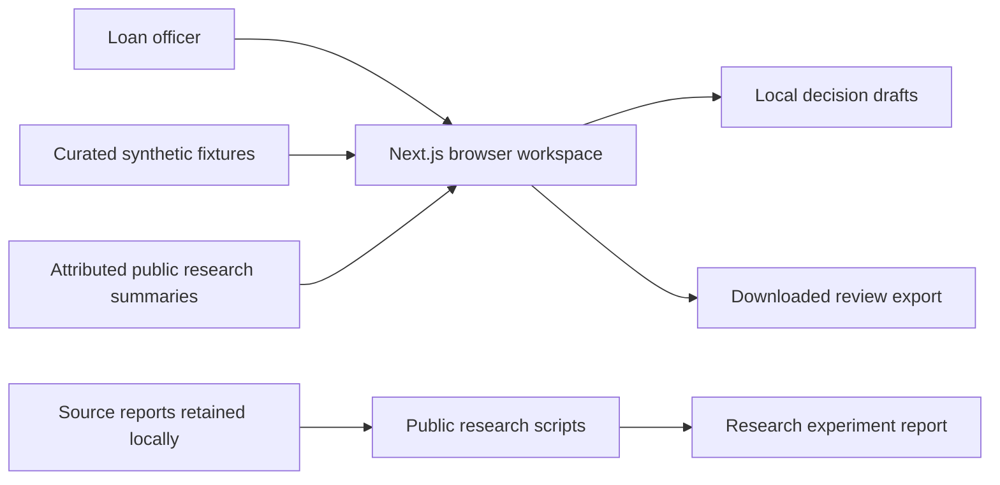
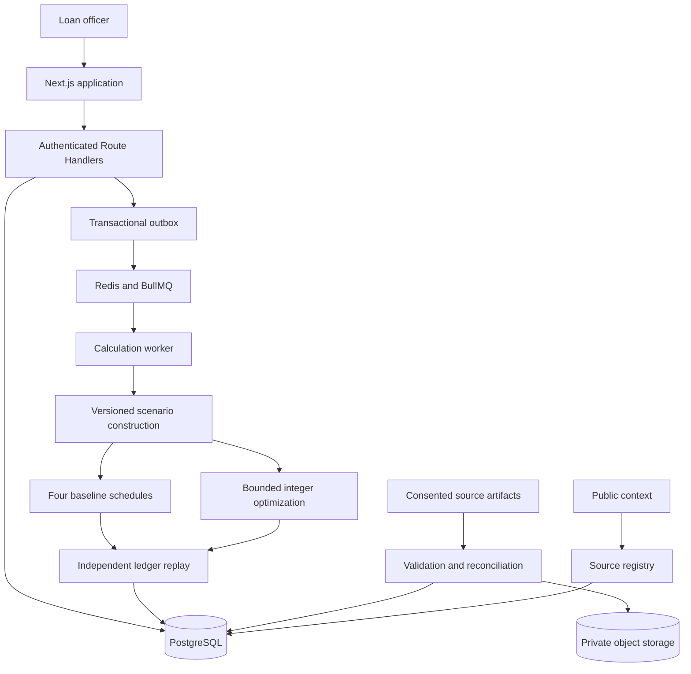

# Architecture

DOMINO has two intentionally separate delivery surfaces: a working browser prototype and a backend implementation prepared for subsequent validation. The prototype demonstrates the review experience using clearly marked synthetic cases. It does not depend on a running database, queue, optimizer, or API.

## Current execution boundary

The browser's demonstration values communicate the proposed workflow. They are not a new run of the financial engine. The scenario interface prepares, stores, and exports assumption drafts without evaluating them. Local decision drafts and downloads are prototype artifacts, with no lender-system side effects.

Backend source is delivered separately. It has deliberately not been started, compiled, tested, benchmarked, or called from the browser during this implementation, following the project request. Source presence must not be read as an operational guarantee. See [implementation status](implementation-status.md).

## Workspace responsibilities

| Area | Responsibility | Evidence boundary |
| --- | --- | --- |
| Overview | Orient the reviewer to the demonstration portfolio, upcoming work, and cash-flow patterns | Portfolio values describe fixtures |
| Borrowers | Find a demonstration case, inspect its profile, history, loan terms, and data quality | Synthetic history remains labelled |
| Plan comparison | Put payment timing, interest, liquidity, and review status side by side | A displayed recommendation is a demonstration outcome |
| Scenario lab | Prepare, save, remove, and export income, expense, timing, and buffer assumptions | Drafts are unevaluated and contain no feasibility or probability result |
| Evidence | Separate fixtures, historical research, and published context | Every source retains its population and reference period |
| Decisions | Prepare a review note and export a proposed decision | Local draft only; no approval or activation in servicing |

## Target production architecture

The implementation guide specifies the following deployment design. This is a target architecture with acceptance gates, not a claim that every service is operational.

The HTTP process should validate requests and persist job intent. CPU-intensive scenario replay and optimization belong in a worker. Evaluation and outbox records must commit together. Repeated queue delivery must converge to one immutable authoritative result.

## Domain boundaries

### Source data

Each imported value needs an origin, a period, a unit, and a transformation history. Borrower observations, entered assumptions, imputations, forecasts, public microdata, public aggregates, and synthetic fixtures are distinct kinds of evidence.

Missing observations stay missing until a source establishes that no activity occurred. Own-account transfers are not new operating income. Loan disbursements are financing. Reversals retain their relationship to the original event. Monthly observations must not silently become weekly histories.

### Evaluation

An evaluation binds an immutable cash-flow snapshot to a loan version, policy version, engine version, scenario definition, and seed if applicable. It contains candidate schedules and per-scenario results. A changed observation or loan balance produces a new evaluation.

Money uses integer paise. The preserved v1 fixture contract uses JavaScript numbers; the new v2 source uses checked `bigint` operations internally and decimal integer strings in JSON. Display formatting converts to rupees at the interface edge. These are explicit contract versions, not interchangeable representations.

### Decision

A candidate and a decision are separate records. A production selection records the evaluation, plan, reviewer, reason, consent reference, and expected loan version. Approval must recheck the loan version and append a new schedule version atomically. Activation in servicing is a separate, explicit integration step.

The browser prototype stops at preparing a local review draft. It does not replace these authorization and persistence requirements.

## Failure semantics

| State | Meaning |
| --- | --- |
| Recommended | At least one evaluated candidate satisfies the named policy and required scenarios |
| No feasible candidate | The candidates evaluated did not pass; this is not proof that no possible schedule exists |
| Proven infeasible | A solver established infeasibility within the precise model, horizon, and policy |
| Search incomplete | The budget expired without a validated candidate; no proof of impossibility |
| Insufficient data | The observations do not support the requested assessment |
| Engine error | A validation, accounting, or model failure that requires investigation |

Only emit the latter production states when the implementation provides the evidence each state requires. A service failure must not become a borrower-risk label.

## Integration sequence

1. Validate the extracted deterministic engine against reviewed hand calculations and historical regression fixtures.
2. Establish API parity using the synthetic cases, then verify authorization and input handling.
3. Add persistent loan versions, immutable snapshots, tenant isolation, idempotency, and durable outbox jobs.
4. Introduce one consented data adapter at a time with rejection and reconciliation reports.
5. Validate scenario construction and any optimizer independently before presenting their results as recommendations.
6. Implement authorized approval and servicing activation, then collect observed outcome evidence.

These steps remain future verification work wherever the [status register](implementation-status.md) records them as unverified or planned.

## Further reading

- [Original detailed implementation guide](../output/DOMINO-Implementation-Guide.md)
- [Model card](model-card.md)
- [Operations and verification boundary](operations.md)
- [Public-data provenance](../data/public/provenance.md)
