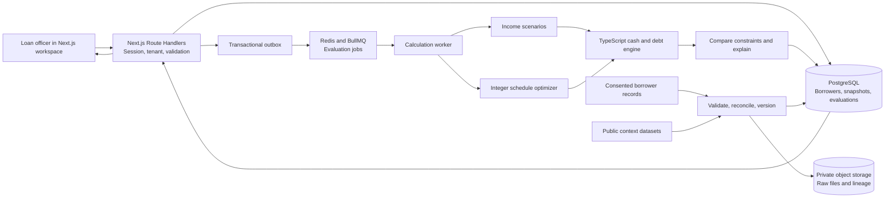
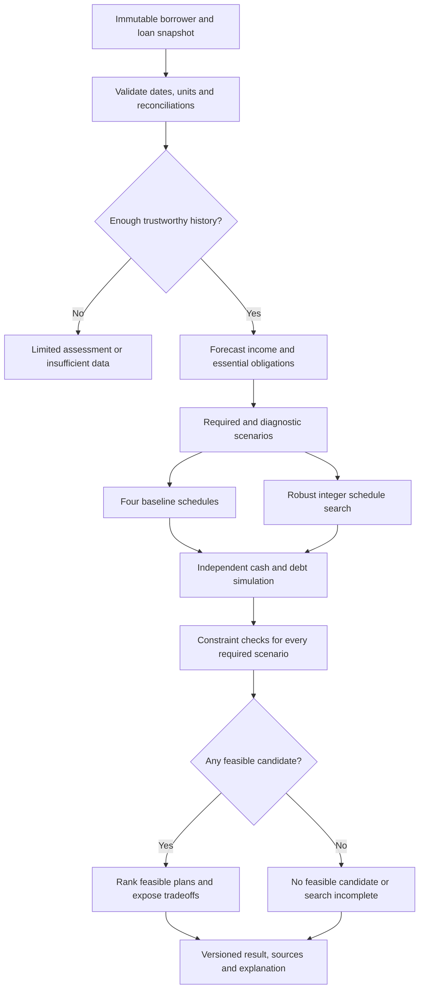

# DOMINO implementation guide

> This specification is retained as the detailed engineering plan. References were updated after consolidation. See [implementation status](../docs/implementation-status.md) for the delivered, verified frontend and deliberately untested backend scope.

**Team:** NueraRangers
**Members:** Shrit Shrivastava, koppala rishikanth, dheeraj sudeep, R Rashmika
**Prepared:** 17 September 2026

DOMINO helps a lender choose repayment dates and amounts that fit a borrower's cash flow. The central engineering challenge is to preserve essential spending and a cash buffer while accounting for every rupee of principal, interest, and missed payments. Build that decision system behind the team's Next.js application, with traceable evidence and a reviewable selection process.

This document is a build specification. The existing calculation code is identified below. Additional components are implementation tasks, with acceptance criteria, so an engineer can start work without confusing architecture with completed software.

## 1. Reuse the working foundation

The inspected workspace contains a pure TypeScript calculation model and a Node HTTP wrapper. The requested application stack is Next.js. Keep the domain code and replace the HTTP wrapper with Next.js Route Handlers when integrating the application.

| Existing component | What the code does | Integration action |
| --- | --- | --- |
| `packages/engine/src/model.ts` | Assesses income patterns; forecasts weekly income; builds four schedules; simulates cash and debt; chooses a feasible candidate | Split into a framework-independent `packages/engine` package |
| `apps/web/app/api/borrowers/route.ts` | Implements borrower list/detail and synchronous evaluation endpoints; validates scenario inputs | Preserve these contracts during the first Next.js integration |
| `packages/engine/src/types.ts` | Defines borrower, scenario, schedule, and ledger types | Expand with explicit source, snapshot, policy, and evaluation types |
| `packages/engine/src/data.ts` | Contains three generated demonstration borrowers | Keep as clearly marked fixtures for repeatable development |
| `packages/engine/tests/` | Checks accounting identities, stress scenarios, recommendation rules, and request validation | Preserve as regression tests; add the acceptance tests below |

The four current schedules are fixed weekly, every four weeks, seasonal surplus, and a six-week reduced start. The current selector requires zero remaining debt and zero stress weeks in the one scenario supplied, then ranks feasible candidates by interest paid. It is a deterministic rules and accounting engine, not a trained default-prediction model.

Two gaps deserve early attention. Current unpaid essentials are reported but are not carried forward as a payable liability. Also, the current assessment relies on aligned weekly history and hard-coded classification thresholds. Imported transaction histories need explicit missing-period handling and validation before those rules are meaningful.

Source: [current model](../packages/engine/src/model.ts), [current API](../apps/web/app/api/borrowers/route.ts), [current types](../packages/engine/src/types.ts), [existing tests](../packages/engine/tests/model.test.ts). These references describe inspected code, not production deployment evidence.

## 2. Application architecture

Use a modular monorepo with two main deployable processes: the Next.js application and a calculation worker. Start with PostgreSQL as the source of truth. Redis and BullMQ distribute evaluations to the worker. Keep the optional optimizer beside the worker until independent scaling is justified.



Architecture: NueraRangers engineering specification. Framework basis: [Next.js Route Handlers](https://nextjs.org/docs/app/api-reference/file-conventions/route) and [Next.js backend guidance](https://nextjs.org/docs/app/guides/backend-for-frontend), accessed 17 September 2026.

Next.js handles the interface, authentication, request validation, and database reads. It should not hold a long optimization run inside an HTTP request. Hosting environments can terminate long-running Route Handlers, so durable jobs execute in the separate worker. Server Components can call shared server services directly; browser interactions use the API.

### Source tree to build

```text
apps/
  web/
    app/
      (workspace)/borrowers/page.tsx
      (workspace)/borrowers/[id]/page.tsx
      (workspace)/evaluations/[id]/page.tsx
      api/borrowers/route.ts
      api/borrowers/[id]/route.ts
      api/borrowers/[id]/evaluate/route.ts
      api/evaluations/[id]/route.ts
      api/evaluations/[id]/plans/[planId]/ledger/route.ts
      api/evaluations/[id]/selections/route.ts
      api/selections/[id]/approve/route.ts
      api/imports/route.ts
      api/sources/[id]/route.ts
    lib/server/{auth,tenancy,db,errors,idempotency}.ts
    components/{CashChart,PlanComparison,SourceNote,DecisionSummary}.tsx
  worker/
    src/{evaluate-job,outbox-publisher,import-job,monitor-job}.ts
    src/optimizer-client.ts
packages/
  contracts/                 # Validation schemas and generated OpenAPI
  engine/
    src/{money,calendar,forecast,scenario,schedules,ledger,rank,explain}.ts
    tests/
  data/
    src/{normalize,reconcile,lineage,features}.ts
    src/adapters/{borrower-csv,public-context}.ts
  db/
    migrations/
    repositories/
services/
  optimizer/
    solver.py                # OR-Tools CP-SAT, bounded worker subprocess
    schemas/
    tests/
benchmarks/
  fixtures/
  evaluate.ts
docs/
  model-card.md
  source-registry.md
  operations.md
```

Pin compatible package versions in lockfiles when scaffolding. Use the installed Node version and the Next.js version actually resolved by the team. Keep secrets in server-only environment variables. No browser bundle should contain raw loan data beyond the currently authorized response.

## 3. Define the records before the routes

| Record | Required information |
| --- | --- |
| `Tenant`, `Membership` | Organization, user, role, access status |
| `Borrower` | Tenant ID, internal borrower ID, display name, currency, consent reference, source category |
| `Transaction` | Stable import key, date, amount in paise, type, account, source record ID, observed/imputed flag |
| `LoanSnapshot` | Principal, accrued interest, overdue principal/interest, rate, day-count method, payment calendar, maturity, fees if applicable, version |
| `EssentialObligation` | Amount, date, carry-forward rule, paid amount, due amount, source |
| `CashFlowSnapshot` | Immutable normalized history, opening cash, loan version, cutoff time, data-quality findings, content hash |
| `SourceArtifact` | Publisher, URL or private object key, retrieval time, reference period, license, geography, units, checksum |
| `PolicyVersion` | Cash buffer, allowed payment dates, collection cap, required scenarios, maximum term, interest limits, ranking rule |
| `Evaluation` | Tenant, snapshot, policy, engine version, scenario hash, random seed, status, timestamps, result hash |
| `CandidatePlan` | Schedule, scenario metrics, violations, explanation references, feasibility status, solver status |
| `Selection` | Evaluation and plan IDs, expected loan version, reviewer, reason, borrower consent reference, selection state |
| `AuditEvent` | Actor, action, record/version, timestamp, request ID, redacted change summary |
| `OutboxEvent` | Durable job intent, aggregate ID, payload version, delivery status |

Use PostgreSQL `bigint` for stored money. Use a checked integer money type in TypeScript. The current engine uses JavaScript numbers, so validate both values and intermediate products against `Number.MAX_SAFE_INTEGER`, or migrate the domain operations to `bigint`. JSON cannot serialize `bigint` directly. Contract v2 can use decimal integer strings for money, with a documented conversion adapter for existing v1 numeric clients. Do not silently switch representations.

Store tenant ID on all sensitive rows and include it in relevant unique keys and indexes. Application authorization is mandatory. Add PostgreSQL row-level security as defense in depth, using a runtime database role that cannot bypass policies. Table owners and privileged roles require special care because their behavior differs from ordinary runtime roles. [PostgreSQL row security](https://www.postgresql.org/docs/current/ddl-rowsecurity.html).

## 4. API contracts and the complete selection journey

The current synchronous contract can remain during migration. Introduce asynchronous evaluation explicitly as contract v2 through a version header or `/api/v2` prefix. The canonical routes below show the endpoint shapes; choose one versioning strategy and document it in OpenAPI.

| Endpoint | Result and important rule |
| --- | --- |
| `GET /api/borrowers?cursor=...&limit=25` | Tenant-scoped summary list, stable cursor, source type, latest evaluation status; no full transaction history |
| `GET /api/borrowers/:id` | Borrower, loan snapshot version, paginated observed cash flow, data quality, source references |
| `POST /api/borrowers/:id/evaluate` | Validate request; persist immutable snapshot, evaluation, and outbox event in one transaction; return `202` and evaluation URL |
| `GET /api/evaluations/:id` | Queued/running/complete/failed state, progress stage, candidate summaries, recommendation, source references |
| `GET /api/evaluations/:id/plans/:planId/ledger?scenarioId=...` | Authorized, paginated ledger for one candidate and one scenario |
| `POST /api/evaluations/:id/selections` | Save a reviewable selection against a completed evaluation and an unchanged loan version |
| `POST /api/selections/:id/approve` | Authorized approval plus borrower consent reference; append a new schedule version atomically |
| `POST /api/imports` | Validate private CSV/object upload; return an import job and row-level validation report |
| `GET /api/sources/:id` | Public provenance or redacted private provenance; never return a private storage URL without authorization |

Illustrative v2 evaluation request:

```json
{
  "loanVersion": 7,
  "policyVersionId": "policy_demo_3",
  "scenarioSetId": "seasonal_required_v1",
  "requestedCandidates": [
    "fixed", "income_aligned", "seasonal", "reduced", "robust_optimized"
  ],
  "assumptions": {
    "minimumBufferPaise": "150000",
    "incomeDelayWeeks": 2,
    "incomeReductionBps": 1500,
    "expenseIncreaseBps": 1000
  }
}
```

Send a unique `Idempotency-Key` header. In a transaction, enforce uniqueness on `(tenantId, route, idempotencyKey)`. Store a canonical request hash with the response reference. A repeat with the same hash returns the original evaluation; the same key with different content returns `409 IDEMPOTENCY_CONFLICT`. An evaluation snapshot must be assembled consistently with the requested loan version.

```json
{
  "contractVersion": "2.0",
  "evaluationId": "eval_example",
  "status": "queued",
  "statusUrl": "/api/evaluations/eval_example",
  "snapshotId": "snapshot_example",
  "loanVersion": 7
}
```

The IDs and request values above are contract examples, not measurements or production records.

An evaluation result has separate `recommendation.status`, `solver.status`, and `dataQuality.status` fields. A validated baseline or a validated solver result with status `FEASIBLE` can support a recommendation even if the search reaches its time limit. In that case, optimality remains unproved. A timeout without any validated candidate is `search_incomplete`, never mathematical infeasibility. Each candidate contains principal, interest, remaining debt, essential shortfalls, arrears, minimum cash, payoff date, and constraint violations per scenario.

### Next.js handler skeleton

This skeleton shows the integration boundary. The named services are implementation tasks, not currently exported functions.

```ts
// apps/web/app/api/borrowers/[id]/evaluate/route.ts
import { requireMember } from '@/lib/server/auth';
import { readBoundedJson, errorResponse } from '@/lib/server/errors';
import { evaluateRequestV2 } from '@domino/contracts';
import { requestEvaluation } from '@/lib/server/evaluations';

export const runtime = 'nodejs';

export async function POST(
  request: Request,
  context: { params: Promise<{ id: string }> },
) {
  try {
    const member = await requireMember(request, 'evaluate');
    const { id } = await context.params;
    const body = evaluateRequestV2.parse(await readBoundedJson(request, 65536));
    const result = await requestEvaluation({
      tenantId: member.tenantId,
      actorId: member.userId,
      borrowerId: id,
      idempotencyKey: request.headers.get('Idempotency-Key'),
      request: body,
    });
    return Response.json(result.body, {
      status: result.httpStatus,
      headers: { 'Cache-Control': 'private, no-store', Location: result.statusUrl },
    });
  } catch (error) {
    return errorResponse(error);
  }
}
```

Current Next.js dynamic route parameters are asynchronous. Keep validation, authorization, and database logic in shared server services so Server Components and Route Handlers use the same rules. [Next.js Route Handler reference](https://nextjs.org/docs/app/api-reference/file-conventions/route).

Validate content type and body length before parsing. Reject unknown fields, non-integer money, invalid dates, duplicate transaction keys, unsupported currencies, and invalid scenario ranges. Scope borrower queries by tenant in the database query itself. Apply tenant/user quotas and rate limits. For cookie-authenticated mutations, verify the request origin and CSRF protection. Return stable error codes and a request ID, never a stack trace or raw private input.

Suggested errors: `400 INVALID_INPUT`, `401 UNAUTHENTICATED`, `403 FORBIDDEN`, `404 BORROWER_NOT_FOUND`, `409 STALE_LOAN_VERSION`, `413 PAYLOAD_TOO_LARGE`, `415 UNSUPPORTED_MEDIA_TYPE`, `422 INSUFFICIENT_DATA`, `429 RATE_LIMITED`, and `503 TEMPORARILY_UNAVAILABLE`. A valid completed calculation with no feasible schedule is an ordinary result, not an HTTP failure.

### Selection is a versioned decision

Selection proceeds through `draft -> reviewed -> approved -> activated`, with `rejected` and `superseded` states. Before approval, check the candidate belongs to the same tenant and evaluation, the underlying loan version still matches, required scenarios pass, the consent reference is present, and the actor has the approver role. An approval transaction appends a schedule version and audit event. A stale evaluation returns `409` and requires recalculation. Only an explicit servicing integration may activate the approved schedule in an external lender system.

## 5. Calculation engine: exact accounting first



Engine design: NueraRangers specification, extending [the existing TypeScript model](../packages/engine/src/model.ts). Optimization machinery: [OR-Tools CP-SAT](https://developers.google.com/optimization/cp/cp_solver).

### 5.1 Normalize and reconcile

Convert income and expenses into dated events before aggregating into analysis weeks. Deduplicate imports using stable source keys. Treat a missing week as unknown until a source confirms no activity. A bank transfer between a borrower's own accounts is not new income. Loan disbursement is financing, not operating income. Refunds and reversals must reference the original event. Keep amounts observed, borrower-entered, imputed, and forecast distinguishable.

Reconcile opening cash plus signed transactions with reported closing cash where available. Expose unexplained differences in a data-quality report. Weekly models can hide same-week timing problems, so replay each selected candidate at daily event resolution before approval. Define whether an income receipt arriving on a due date is available before collection.

### 5.2 Forecast timing and amount separately

Retain seasonal-naive forecasting as a benchmark. Compare it with a rolling-median baseline and a model of receipt timing and positive receipt amounts for irregular earners. Use only observations before the evaluation cutoff. Run rolling-origin backtests, reporting error by forecast horizon and income pattern. Two years may support annual-pattern analysis; shorter histories need an explicit limited-evidence result and simpler assumptions.

Generate income and expense paths using block resampling or explicitly defined stress transformations that preserve receipt timing and clustered low-income periods. Save the generation method and random seed. Use household observations to estimate household cash flow; use public district or national data as context or a scenario driver only. A district crop price series does not reveal an individual borrower's sales volume, costs, or bank balance.

Separate two sets:

1. **Required scenarios:** named, policy-approved conditions that every recommended plan must satisfy.
2. **Diagnostic scenarios:** severe tail conditions that expose failure boundaries, such as total loss of income. Their failure does not automatically invalidate a plan unless policy includes them in the required set.

A fraction of simulated scenarios passing is a scenario coverage measure. It becomes a probability only with a defensible, calibrated sampling model. Display the scenario count and construction method beside any such percentage.

### 5.3 Money, interest, and event ordering

For the first migration, preserve the current convention: simple weekly interest on opening outstanding principal, `APR / 52`, no compounding, rounded to the nearest paise each week. Store that convention with the result. A lender contract using actual days, monthly accrual, compounding, penalty charges, or fees requires a separately versioned policy and independent test fixtures.

Let `C` be cash, `P` outstanding principal, `I` accrued unpaid interest, `A` principal arrears, and `E` unpaid essential obligations. For one period:

```text
interestAccrued = roundPaise(openingPrincipal * aprBps / (10_000 * 52))
availableCash = openingCash + receivedIncome
essentialLiability = openingEssentialArrears + newEssentialObligations
essentialsPaid = min(availableCash, essentialLiability)
essentialArrears = essentialLiability - essentialsPaid
cashAfterEssentials = availableCash - essentialsPaid

accruedInterest = openingUnpaidInterest + interestAccrued
principalDue = openingPrincipalArrears + newlyScheduledPrincipal
interestDue = previouslyDueInterest + newlyDueAccruedInterest
affordablePayment = max(0, cashAfterEssentials - minimumBuffer)
actualPayment = min(affordablePayment, principalDue + interestDue)
interestPaid = min(actualPayment, interestDue)
principalPaid = actualPayment - interestPaid

closingCash = cashAfterEssentials - actualPayment
closingPrincipal = openingPrincipal - principalPaid
closingUnpaidInterest = accruedInterest - interestPaid
closingPrincipalArrears = principalDue - principalPaid
closingDueInterest = interestDue - interestPaid
```

Newly due interest must exclude interest already marked due. Let `P0` be the opening outstanding principal in the evaluation's loan snapshot, after all posted principal repayments. Principal arrears `A0` are a subset of `P0`, not additional debt. The full obligation schedule, including any opening overdue bucket, must allocate exactly `P0`; it must exclude principal already repaid. When retaining existing arrears, initialize the due accumulator with `A0` and allocate only `P0 - A0` as new future principal dues. When simulating an authorized replacement schedule that reallocates all of `P0`, mark the old overdue amounts as incorporated and do not add them again to the due accumulator. Preserve their historical status and require explicit policy permission for any rescheduling of overdue amounts. Due interest is likewise part of accrued unpaid interest. At maturity, make all residual accrued interest due even if the schedule has no principal installment that week. Disclose any unpaid amount at the horizon.

Some missed consumption cannot be repaid later, such as a skipped meal. Represent true payable essential bills as carried liabilities and non-recoverable deprivation as a separate cumulative shortfall. Do not invent an invoice to represent every unmet need. For the initial demo's aggregate essentials, explicitly select and label a simplifying treatment, then use richer categories on import.

Preserve these identities for every ledger row:

- Closing cash equals opening cash plus income minus actual essentials payments minus actual loan payments.
- Closing principal equals opening principal minus principal paid.
- Closing interest equals opening interest plus accrual minus interest paid.
- Loan payment equals principal paid plus interest paid.
- Essential arrears equal opening arrears plus new payable essentials minus essentials paid.
- No payment can exceed the amount due or make cash negative. Loan payments cannot consume the protected buffer.
- The full principal obligation schedule, including any opening overdue bucket, sums exactly to snapshot opening outstanding principal `P0`. Opening principal arrears are counted once, already repaid principal is excluded, and final rounding adjustments cannot erase debt.

Source for the starting convention and identities: [current simulation and ledger](../packages/engine/src/model.ts). The carried essential-liability design is an extension specified here.

## 6. Schedule optimization that can be defended

Keep all four rule schedules as understandable benchmarks. Add one optimized candidate that chooses repayment dates and principal amounts. Use integer paise and OR-Tools CP-SAT in a bounded Python subprocess behind the worker. CP-SAT operates on integer constraints and reports optimal, feasible, infeasible, invalid, or unknown outcomes. Record these separately. [OR-Tools solver reference](https://developers.google.com/optimization/cp/cp_solver).

### Variables and shared schedule

For period `t`, choose principal due `d[t] >= 0` and payment-date indicator `y[t] in {0,1}`. Define `P0` as the snapshot's opening outstanding principal after posted repayments, including any principal arrears exactly once. All required scenarios share the chosen schedule. The optimizer cannot rewrite the schedule after seeing which future scenario occurs.

For a replacement schedule, use `d[t] <= P0 * y[t]`, restrict `y` to permitted collection dates, enforce the payment calendar and any agreed minimum gap, and require `sum(d) = P0`. This is outstanding principal, not the original disbursement amount. Incorporate carried overdue principal into the schedule once. If policy requires it to remain immediately due, represent it as a fixed opening due bucket `d[0] = A0`, with only `P0 - A0` allocated to later periods, and apply the cash and feasibility checks to that opening bucket. Otherwise, reallocating its date requires explicit rescheduling permission. Do not separately add `A0` to a schedule already allocating all of `P0`. Set a maturity payment date. Permit interest-only dates only if the loan policy allows them.

For the proposed feasible schedule, outstanding principal follows `P[t] = P[t-1] - d[t]`. Weekly accrual uses the same rounding as the simulator. Since all required scenarios must pay all installments on time, this principal path and its accrued interest are shared across them. Accrued interest becomes due on payment dates; conditional constraints implement either full payment of the accrued balance or deferral. Total contractual payment is `q[t] = d[t] + interestDue[t]`.

To encode positive half-up weekly rounding exactly, with `D = 520000`, constrain integer accrual `i[t]` so:

```text
D * i[t] <= P[t-1] * aprBps + D / 2
P[t-1] * aprBps + D / 2 <= D * (i[t] + 1) - 1
```

Check bounds for every product against the solver's integer limits before model construction. Lock the rounding convention in both implementations. Do not assume a floating-point solver result is a valid paise schedule.

### Required feasibility constraints

For every required scenario `s`, apply known income `income[s,t]` and essential obligations `essentials[s,t]`:

```text
cash[s,t] = cash[s,t-1] + income[s,t] - essentialsPaid[s,t] - q[t]
cash[s,t] >= policy.minimumBuffer
essentialArrears[s,t] == 0
principalArrears[s,t] == 0
interestArrears[s,t] == 0
principalAtMaturity == 0
unpaidInterestAtMaturity == 0
q[t] <= policy.maximumInstallmentPaise
totalInterest <= policy.maximumInterestPaise
```

An opening essential liability must also be cleared according to the policy before loan repayment. Handle an opening buffer already below the minimum explicitly: either the case fails the strict policy or a separately approved recovery policy defines the permitted restoration period. Never quietly weaken the buffer constraint. Exclude loan extensions unless the evaluation's policy explicitly permits them, with the new maturity shown.

### Ranking and the interest-versus-liquidity tradeoff

First find schedules satisfying all hard constraints. Then solve in stages:

1. Search for the lowest total interest among feasible schedules. Call the returned value the **minimum** only when the solver reports `OPTIMAL` for this stage. With a timed `FEASIBLE` result, call it the **best-found interest** and persist the feasible value, solver's objective lower bound, time limit, and absolute/relative gap.
2. Use an explicit interest reference `Iref` and approved additional-interest budget `delta`. Enforce `totalInterest <= Iref + delta` while searching for the lowest maximum installment. If stage 1 was `OPTIMAL`, `Iref` is the proven minimum and `delta` is the maximum premium over it. If stage 1 was only `FEASIBLE`, `Iref` is the best-found value and the cap is a premium over that reference, not over the unknown optimum. With a valid lower bound `B`, report the conservative bound `Iref + delta - B` on the possible premium above optimum. Keep the policy's absolute interest cap in force in both cases.
3. Break ties by fewer payment dates, less change from an existing accepted schedule, and finally stable schedule ordering. Record whether each optimization stage proved its optimum; a timed stage must not be presented as a proven lexicographic optimum.

This avoids a hidden arbitrary score that lets low interest compensate for unpaid essentials. Persist the policy values, reference interest and its provenance, objective values, bounds, gap definition, and solver status for each stage. An absolute gap is measured in paise for the interest objective; define the relative-gap denominator and handle zero explicitly. Re-run every candidate through the independent TypeScript simulation across all required and diagnostic scenarios. Reject a candidate if its independent ledger violates the solver's claimed constraints. For small instances, enumerate schedules and compare the optimum to the solver.

An optimized plan is not automatically selected. Compare it with the four baselines using the same feasibility rules and ranking. A validated baseline or a validated `FEASIBLE` solver candidate remains eligible when further search times out. Show the winning plan's additional interest relative to the explicitly named reference, minimum cash, largest payment, failure scenarios, and changes in dates. If optimality is unproved, state that a better feasible schedule may exist.

### Non-success outcomes

| Outcome | Exact meaning and interface wording |
| --- | --- |
| `recommended` | At least one independently validated baseline or solver candidate meets required constraints; solver optimality is a separate field and may remain unproved |
| `no_feasible_candidate` | None of the evaluated baseline candidates passes; exhaustive search has not established that every possible schedule fails |
| `proven_infeasible` | The solver proves no schedule exists within this policy, horizon, scenario set, and model |
| `search_incomplete` | The time or resource budget expired and neither the baselines nor solver produced a validated feasible candidate; no proof of impossibility |
| `insufficient_data` | Inputs do not support the requested assessment |
| `engine_error` | Invalid model, invariant failure, or inconsistent result; never turn this into a borrower risk label |

If policy feasibility fails, compute a separately labelled diagnostic relaxation, such as the smallest extra opening cash needed or the minimum term extension under a permitted comparison. Such a relaxation explains a constraint and is not an approved recommendation.

## 7. Public data and truthful impact measurement

Build a source registry and adapter boundary instead of presenting external statistics as individual borrower histories.

Use the accompanying [public-data provenance manifest](../data/public/provenance.md) as the source registry for the deck and benchmark dashboard. NABARD rural household income/expenditure aggregates and SIDBI microfinance borrower aggregates belong in a `public-context` adapter. Keep each report's reference period, population, units, table/page, retrieval date, and transformation. Those tables can establish the size and cash-flow context of the problem. They do not supply borrower transaction histories or validate a repayment recommendation. A later consented borrower-ledger adapter must map actual dated income, expense, loan, and repayment observations to the engine separately.

### Delivered monthly diary records for research

[Source C in the provenance manifest](../data/public/provenance.md#source-c-india-financial-diaries-via-finmark-trust-public-portal) documents the public India Financial Diaries records retrieved through FinMark Trust. The delivered [household-month file](../data/public/finmark_india_household_months.csv) contains **86 households, 365 household-month rows, and 356 paired income-and-expense observations**. Its coverage is Varanasi and outskirts, February to June 2013. The source describes the sample as not nationally representative. These are historical monthly household observations, not verified weekly borrower records or DOMINO users.

The accompanying [cash-flow analysis](../data/public/finmark_cashflow_analysis.md) finds income below reported expense outflow in **156 of 356 paired household-month observations (43.82%)**. Among the **85 households with at least one paired month**, 75 have at least one such month. Restricting the calculation to the 56 households with all five paired months gives 117 of 280 months (41.79%) and 49 of 56 households. All 26 negative reported income observations remain in the full paired sample. These are observed income-expense gaps, not unmet essential spending, defaults, eligibility decisions or measured benefits from DOMINO. The uneven reporting and historical, local sample prevent extrapolation to India's borrower population. Reproduce these figures with `python3 data/public/analyze_finmark_cashflow.py`.

Implement a `finmark-monthly-research` adapter that reads the delivered CSV, links each value to [the quality report](../data/public/finmark_data_quality.json) and raw response, and retains monthly frequency in its schema. The [long-format file](../data/public/finmark_india_monthly_long.csv) preserves the category-level observations. Reproduce the import and quality counts with `python3 data/public/analyze_finmark_diaries.py` from the repository root.

- Preserve blanks as missing, not zero. There are 357 income-month observations and 364 expense-month observations; only 56 households have paired records for every one of the five months. Label the denominator in every calculation.
- Preserve the source's negative expense sign in `expense_signed_inr`; use the separately derived positive `consumption_outflow_inr` only for display or a clearly defined transformation.
- Preserve and flag the 26 negative reported income-month values. Do not clip, take absolute values, or interpret them as negative cash receipts until the component definitions and codebook are understood.
- Do not interpolate these monthly totals into observed weeks. Five months of history do not establish annual seasonality or validate the existing two-year weekly forecast.
- The selected source response has no verified loan schedules, opening cash balances, essential-expense classifications, treatment indicators, or subsequent default outcomes. It cannot support a real repayment-feasibility result without those additional inputs. Any assumed loan or opening balance must be visibly labelled as a research scenario.
- Use the records for import validation, missing-data analysis, monthly cash-flow charts, and exploration of household variation. Keep them in a research dataset separate from operational borrower records. Review the source's access terms and the documented publication-license ambiguity before external redistribution.

Source: [India Financial Diaries portal](https://finmark.org.za/data-portal/IND/financial-diaries), delivered [provenance](../data/public/provenance.md), and [data-quality report](../data/public/finmark_data_quality.json). These counts describe records analyzed, not people helped.

```ts
interface SourceDescriptor {
  id: string;
  publisher: string;
  url?: string;
  referencePeriod: string;
  retrievedAt: string;
  geography: string;
  unit: string;
  licenseOrAccessTerms: string;
  checksum: string;
  kind: 'borrower_observation' | 'public_aggregate' | 'public_microdata' | 'fixture';
}

interface DataAdapter<T> {
  source: SourceDescriptor;
  validate(raw: unknown): { records: T[]; rejected: unknown[] };
  normalize(records: T[]): NormalizedRecord[];
  lineage(record: NormalizedRecord): SourceRecordReference[];
}
```

Import public aggregates for market context, seasonality drivers, or scenario ranges only when their units and reference periods match the use. Public microdata can support an offline research benchmark if its license allows use and it actually contains the needed repeated income, expense, and repayment observations. Do not synthesize weekly income from an annual survey and call it observed weekly cash flow. An external historical dataset remains external historical data, not DOMINO users.

Every chart must include a title that names the measure and chart type, axis units, time period, population or sample, and a source note below it. Distinguish observed points from projected paths visually. Example: `Weekly cash balance, line chart | INR | 26-week scenario | Source: DOMINO evaluation <id>, borrower snapshot <hash>, engine <version>; projected values.` A public market chart cites its publisher, exact table/report date, URL, and any transformation.

Measure these separately:

| Metric | Counting rule |
| --- | --- |
| Addressable population | Published source's stated population with date and definition |
| Public records analyzed | Unique eligible records in the downloaded dataset after exclusions |
| Borrowers evaluated | Distinct consented borrower IDs with a completed evaluation |
| Feasible schedules found | Distinct evaluated borrowers with at least one passing candidate under a named policy |
| Schedules accepted | Distinct borrowers with a confirmed accepted schedule |
| Outcomes observed | Observed essential shortfalls, arrears, recovery and borrower cash after activation over a stated follow-up window |

A computed improvement on a historical dataset is an offline comparison. Establish real improvement through a lender pilot with an agreed comparison design, follow-up period, and outcome definitions. Track adverse outcomes and total interest alongside reduced payment stress. No current customer or beneficiary count is established by the inspected repository.

## 8. Reliable execution and scaling

Write the evaluation row and its outbox event in one PostgreSQL transaction. An outbox publisher retries delivery to BullMQ. Use the evaluation ID as a stable job identity, but treat deliveries as potentially repeated. The worker checks whether the immutable result is already committed, computes from its snapshot, then commits the result with a unique constraint. Retrying a job must produce the same authoritative state. BullMQ recommends idempotent jobs for retries; queue deduplication alone is not a complete transactional guarantee. [BullMQ idempotent jobs](https://docs.bullmq.io/patterns/idempotent-jobs), [deduplication](https://docs.bullmq.io/guide/jobs/deduplication).

Partition workload by tenant and set per-tenant concurrency and resource limits. Separate bulk imports from interactive evaluation queues. Use bounded worker pools because the solver and ledger loops consume CPU. Send only IDs and immutable snapshot references through the queue, not raw borrower files. Add heartbeats, timeouts, bounded retries with jitter, a failed-job queue, and operator-visible error categories.

The deterministic replay cost grows approximately with candidates times scenarios times periods. For example, five candidates over 100 scenarios and 52 weeks produce **26,000 ledger steps per borrower**, or **26 million for a 1,000-borrower batch**, before optimization cost. This is arithmetic workload sizing, not a measured throughput claim. Benchmark solver time separately because it need not grow linearly.

Keep summary metrics in PostgreSQL and compress large scenario ledgers into private object storage with checksums. Read one plan/scenario ledger on demand. Index borrower lists by `(tenant_id, updated_at, id)` and evaluations by `(tenant_id, borrower_id, created_at)`. Do not return every scenario's full ledger on the summary endpoint. Cache immutable non-sensitive computations by snapshot/policy/model hash only within the correct access boundary.

Suggested initial benchmark targets, to be measured before making performance claims:

| Path | Initial engineering target | Benchmark conditions to publish |
| --- | --- | --- |
| Borrower list/detail | p95 below 300 ms | Database size, index state, payload size, hardware, concurrency |
| Evaluation accepted into durable queue | p95 below 500 ms | Includes authentication, snapshot write and outbox commit |
| Four baselines and bounded scenario replay | p95 below 2 seconds | Exact periods, scenario count and hardware |
| Optimization worker | 5-second initial search budget | Solver version, variables/constraints, status and optimality information |
| Duplicate submission/retry | One authoritative evaluation result | Concurrent retries and worker-crash tests |

These are design targets, not achieved numbers. Emit structured metrics for queue age, processing duration, scenario count, solver status, invariant failures, source freshness, and approval conflicts. Redact transaction content from logs. Store request, evaluation, snapshot, and policy IDs to join traces without copying private data.

## 9. Implementation sequence with acceptance gates

### Phase 1: Next.js integration and faithful parity

1. Extract the current engine without changing arithmetic.
2. Add borrower GET routes and synchronous evaluation Route Handler against existing fixtures.
3. Share validation types between frontend and backend.
4. Render human-readable plan names, consistent INR units, observed/projected markers, and source notes.

**Accept when:** the new route produces the same schedules and ledger values as the existing API for the saved fixtures and stressed cases; malformed requests are rejected; the frontend explains each chart and its source. Use the existing regression suite as an engineering check, not as a headline impact metric.

### Phase 2: Persistent evidence and reliable jobs

1. Add database migrations, tenant membership, immutable snapshots, source registry, evaluations, and outbox.
2. Add authenticated imports and data-quality reports.
3. Implement async contract v2, worker jobs, status polling, and paginated ledgers.
4. Add idempotency, request version checks, private storage, and retention/deletion handling.

**Accept when:** two tenants cannot read or select each other's records; duplicate requests return the original evaluation; worker crashes before and after commit do not duplicate results; source checksum and model version reproduce a result; a changed loan returns a stale-version conflict.

### Phase 3: Stronger accounting and real-data adapters

1. Add payable essential arrears and a separate unmet-consumption measure.
2. Define date ordering, rounding, maturity accrual, reversals, and opening balances.
3. Add event-level reconciliation and daily approval replay.
4. Implement one source adapter at a time and produce a rejection/coverage report.

**Accept when:** hand-calculated fixtures reconcile cash, principal, interest, and essentials; a partially repaid loan allocates only its opening outstanding principal and counts overdue principal once; every terminal unpaid balance remains visible; missing periods stay distinct from zero income; duplicate imports are harmless; aggregated public data cannot enter the borrower-observation field without an explicit provenance transformation; the FinMark import reproduces 86 households, 365 household-month rows and 356 paired observations while retaining monthly frequency, missing values, and negative values.

### Phase 4: Uncertainty and constrained optimization

1. Backtest forecasting methods with strict time cutoffs.
2. Implement versioned required and diagnostic scenario sets.
3. Add the integer optimizer with bounded runtime and recorded status.
4. Independently replay optimized schedules and compare with baseline candidates.

**Accept when:** toy problems match exhaustive enumeration; a timing-only cash shortage is distinguishable from insufficient total resources; all-zero income does not receive an affordable recommendation; rounding matches across Python and TypeScript; a timeout without any validated candidate yields `search_incomplete`; a validated baseline or `FEASIBLE` solver candidate can still support `recommended` with unproved optimality; stage 1 uses minimum wording only for `OPTIMAL`, while timed feasible references report bounds/gaps and enforce an honestly described extra-interest cap; a baseline can be selected when it beats the optimized candidate; seeded scenario replay is reproducible.

### Phase 5: Approval, monitoring, and outcome evidence

1. Add role-based review, consent references, versioned approval, and schedule export.
2. Monitor actual-versus-forecast cash and upcoming payment pressure.
3. Recalculate when new observations warrant it, creating a new evaluation rather than rewriting the accepted result.
4. Measure pilot outcomes and publish benchmark methodology with actual measurements.

**Accept when:** an authorized reviewer can trace a selected installment back to loan terms, cash assumptions, constraints, and source records; an outdated evaluation cannot overwrite a newer loan; changing forecasts never silently changes an accepted repayment agreement; outcome charts identify population, period, source, and comparison method.

## 10. First engineering task to start now

Create `packages/engine` from the current TypeScript model, retaining its tests and saved JSON outputs. Implement the three existing borrower routes as Next.js Route Handlers using those same functions. Render one borrower end to end: observed history, named schedule comparison, a clearly labelled weekly cash-balance line chart, ledger details, and a source note. Then add persistent snapshot IDs before bringing in public data or optimization. This provides a working vertical slice on which the deeper system can be built and measured.

## Technical references

All web references were checked on 17 September 2026. The model formulation, contracts, implementation tasks, and benchmark targets in this document are DOMINO engineering decisions, not claims made by these documentation sources.

- [Next.js Route Handlers](https://nextjs.org/docs/app/api-reference/file-conventions/route): request handlers, supported methods, asynchronous route parameters.
- [Next.js backend for frontend guidance](https://nextjs.org/docs/app/guides/backend-for-frontend): API boundary, authorization, hosting constraints for long requests.
- [PostgreSQL row security](https://www.postgresql.org/docs/current/ddl-rowsecurity.html): policies, default denial, and role behavior.
- [BullMQ idempotent jobs](https://docs.bullmq.io/patterns/idempotent-jobs): retry-safe execution.
- [BullMQ deduplication](https://docs.bullmq.io/guide/jobs/deduplication): queue-level duplicate handling.
- [Google OR-Tools CP-SAT](https://developers.google.com/optimization/cp/cp_solver): integer constraint modeling and distinct solve statuses.
- [DOMINO current calculation model](../packages/engine/src/model.ts), [API](../apps/web/app/api/borrowers/route.ts), and [model tests](../packages/engine/tests/model.test.ts): inspected implementation evidence.

## 11. Commercial strategy and pilot design

The buyer is a lender's lending-operations or risk team. The first product is an internal decision tool that helps loan officers compare affordable schedules, record why they selected one, and export a reviewed decision to the servicing system. The lender pays the software subscription. Borrowers do not pay a separate DOMINO software charge under this proposal.

### Pricing and the account definition

| Commercial item | Proposed terms |
| --- | --- |
| Paid pilot | ₹50,000 for eight weeks and up to 1,000 borrower accounts |
| Recurring subscription | ₹15,000 per lender organization per month, plus ₹5 per active borrower per month |
| Illustrative 10,000-account contract | ₹15,000 + ₹5 × 10,000 = ₹65,000 monthly; twelve identical paid months = ₹7,80,000 annual contract value (₹7.8 lakh) |
| Borrower charge | No separate DOMINO software fee |

Define an active borrower as one distinct tenant borrower ID with an open account included in evaluation or monitoring during the billing month. Repeated evaluations and multiple loans do not create duplicate borrower charges. Exclude deleted test fixtures and historical archives. Agree the definition in the order form before billing. The example assumes constant account count, twelve paid months, no discounts and no tax. It is pricing arithmetic, not booked revenue or a forecast.

The base fee covers a standard workspace, source registry, audit trail and routine support. The per-borrower fee aligns revenue with the population actually monitored. Confirm evaluation frequency, scenario limits and storage retention during the pilot, then specify fair-use limits. Quote unusual integrations separately after measuring the work. Track worker compute, database/storage, support hours and import-reconciliation time before making any gross-margin claim.

### Pilot prospects and why they fit

- **Dvara KGFS:** its rural financial-services focus makes it a relevant prospect for studying irregular household cash flow and loan-officer workflows. Source: [Dvara KGFS](https://www.dvarakgfs.com/).
- **CreditAccess Grameen:** its microfinance operations make it a relevant prospect for examining how schedule review fits branch and risk processes. Source: [CreditAccess Grameen, about the company](https://www.creditaccessgrameen.in/about-us/).

These names are outreach targets. There is no evidence here of an agreement, endorsement, data-sharing arrangement or active pilot. No outreach has been sent. Begin with an operations owner and a risk owner who can define the decision, supply permissioned records and evaluate whether the workflow is useful.

### Eight-week pilot scope

| Period | Work and evidence to collect |
| --- | --- |
| Weeks 1-2 | Agree an eligible cohort, data access, loan-policy rules and baseline review process. Reconcile imported data and document coverage. |
| Weeks 3-4 | Run historical replay and shadow evaluations. Compare outputs with officer decisions without changing live schedules. Investigate every accounting discrepancy. |
| Weeks 5-6 | Let officers compare and review recommendations. Record review duration, rejection reasons and changes in recommended payment dates. Any live schedule change needs the lender's authorized process and borrower agreement. |
| Weeks 7-8 | Compare the agreed process measures, investigate exceptions, report cohort coverage and decide whether an annual rollout is justified. Continue repayment-outcome follow-up beyond the pilot where necessary. |

The 1,000-account ceiling is a scope target. It is not the count of people helped and does not guarantee statistical power. Define sample size and observation length around the chosen primary metric and the lender's repayment cycle. An eight-week workflow pilot alone cannot prove long-term default reduction.

Measure officer review time per eligible case, data rejection rate, recommendation acceptance with reasons, and accounting/reconciliation failures. Measure missed installments and observed cash shortfalls only when suitable dated records exist. Report the denominator and observation period for every metric. A credible impact study needs a justified comparison group or phased assignment and sufficient follow-up. Keep observed changes distinct from modeled savings. A real beneficiary count should identify unique borrowers with an agreed, observed benefit and should not multiply sector size by an assumed penetration rate.

Source for prices, pilot duration, account target and rollout sequence: NueraRangers commercial proposal authored for this project. These assumptions require buyer validation.

## 12. Evidence behind the presentation

| Slide evidence | Exact basis | Interpretation |
| --- | --- | --- |
| Team name and members | User-provided names | NueraRangers; Shrit Shrivastava, Koppala Rishikanth, Dheeraj Sudeep, R Rashmika |
| Workflow and four baseline schedules | `packages/engine/src/model.ts` and `api.ts` | Existing local calculation implementation |
| ₹12,698 income and ₹11,262 consumption | NABARD NAFIS 2021-22, Table 5.1, printed p.45 | Published monthly household averages; not an installment limit |
| Approximately 5.5 crore unique live borrowers | SIDBI and Equifax Microfinance Pulse XXVII, pp.4,8, as of 31 March 2026 | Dated sector context; not DOMINO users |
| 86 households and 365 monthly records | Public FinMark India Financial Diaries response; extraction scripts and quality report | Historical Varanasi research data, February to June 2013; no verified loan outcomes |
| Next.js, queue, database and optimization diagram | This engineering specification and linked official documentation | Next.js is the team's chosen stack; additional integration work is specified in this guide |
| Pricing, 1,000-account pilot and named prospects | Commercial section above | Proposals and prospect selection; not revenue, deployment or partnership evidence |

Primary public sources, page references, retrieval dates, transformations, quality limitations and checksums are in [data/public/provenance.md](../data/public/provenance.md). The observed diary file and the published survey tables are different evidence types and must remain separate in the application. Source PDFs are retained locally for research and are not bundled into a distribution archive.
